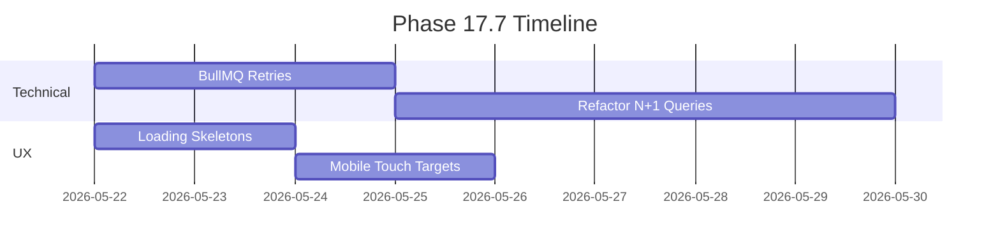

# Phase 17.7: Technical & UX Debt Reduction

**Objective**: Improve reliability, scalability, and user experience by addressing critical technical debt and UX gaps identified in the KidSpot platform.

**Success Criteria**:
- Autonomous enrichment engine achieves 99.9% job success rate.
- UX improvements reduce bounce rate by 15% (via Plausible analytics).

---

## 1. Technical Debt

### 1.1 Autonomous Enrichment Engine
**Problem**: Job failures, stalled workers, and manual deduplication create data inconsistency and operational overhead.

**Tasks**:
| Priority | Task | Owner | Effort | Status |
|----------|------|-------|--------|--------|
| P0 | Add BullMQ retry logic (3 attempts, exponential backoff) | Backend | Medium | ⬜ |
| P0 | Configure BullMQ's native `failed` set retention and log to Pino | Backend | Medium | ⬜ |
| P0 | Configure stalled job detection (`stalledInterval`) | Backend | Low | ⬜ |
| P1 | Replace manual deduplication with `ON CONFLICT` clauses | Backend | High | ⬜ |
| P1 | Integrate Prometheus for job queue monitoring | Backend | High | ⬜ |
| P2 | Standardize error handling with Pino | Backend | Medium | ⬜ |
| P2 | Make job batch sizes configurable via `.env` | Backend | Low | ⬜ |

**Evidence**:
- Job failures logged but not retried (`worker.ts:240`).
- Custom deduplication logic (`dedup-sweep.ts`).

---

### 1.2 Data Pipeline
**Problem**: GitHub Actions pipelines and Express endpoints lack observability and error recovery.

**Tasks**:
| Priority | Task | Owner | Effort | Status |
|----------|------|-------|--------|--------|
| P0 | Add structured logging for job outcomes (Pino) | Backend | Medium | ⬜ |
| P1 | Refactor N+1 query loops in `venueService.ts` to use bulk `JOIN`s or `WHERE id IN (...)` | Backend | High | ⬜ |
| P2 | Add PostGIS spatial indexes to frequently queried columns | Backend | Medium | ⬜ |

**Evidence**:
- N+1 queries in `venueService.ts`.
- Hardcoded job cleanup (`worker.ts`).

---

## 2. UX Improvements

### 2.1 Search Experience
**Problem**: Latency, zero-results frustration, and mobile friction reduce engagement.

**Tasks**:
| Priority | Task | Owner | Effort | Status |
|----------|------|-------|--------|--------|
| P0 | Add loading skeletons for search results | Frontend | Low | ⬜ |
| P0 | Implement zero-results state with suggestions | Frontend | Low | ⬜ |
| P1 | Improve mobile radius slider UX | Frontend | Medium | ⬜ |
| P2 | Add "Recent Searches" feature | Frontend | Medium | ⬜ |

**Evidence**:
- Missing loading states (`venue-list.tsx`).
- No zero-results handling.

**Code Snippet** (Loading Skeletons):
```tsx
// /frontend/src/components/venues/venue-list.tsx
{isLoading && (
  <div className="space-y-4">
    {[...Array(3)].map((_, i) => (
      <div key={i} className="ks-card animate-pulse">
        {/* Skeleton layout */}
      </div>
    ))}
  </div>
)}
```

---

### 2.2 Mapping
**Problem**: Performance issues and limited interactions hinder usability.

**Tasks**:
| Priority | Task | Owner | Effort | Status |
|----------|------|-------|--------|--------|
| P0 | Add lazy-loading for map tiles/venues | Frontend | Medium | ⬜ |
| P1 | Enhance venue popups with images/ratings | Frontend | Medium | ⬜ |
| P2 | Optimize touch interactions (debounce) | Frontend | Medium | ⬜ |

**Evidence**:
- No dynamic loading in `venue-map.tsx`.

**Code Snippet** (Rich Popups):
```tsx
// /frontend/src/components/map/venue-map.tsx
const popup = new maplibregl.Popup()
  .setHTML(`
    <div>
      
      <h3>${venue.name}</h3>
      <p>${venue.reviews} reviews</p>
    </div>
  `);
```

---

### 2.3 Mobile Optimization
**Problem**: Touch targets and offline behavior degrade mobile experience.

**Tasks**:
| Priority | Task | Owner | Effort | Status |
|----------|------|-------|--------|--------|
| P0 | Increase touch target sizes (>=48x48px) | Frontend | Low | ⬜ |
| P1 | Add service worker for offline caching | Frontend | High | ⬜ |
| P2 | Standardize loading states | Frontend | Medium | ⬜ |

**Evidence**:
- Small buttons in `@media (hover: none)`.

**CSS Snippet**:
```css
/* /frontend/src/app/globals.css */
@media (hover: none) {
  button, [role="button"] {
    min-height: 48px;
    min-width: 48px;
  }
}
```

---

### 2.4 SEO
**Problem**: Programmatic pages lack metadata and structured data.

**Tasks**:
| Priority | Task | Owner | Effort | Status |
|----------|------|-------|--------|--------|
| P0 | Add dynamic metadata for borough/category pages | Frontend | Medium | ⬜ |
| P1 | Restrict canonical URLs and `LocalBusiness` schema strictly to static pages | Frontend | Medium | ⬜ |
| P1 | Add `<meta name="robots" content="noindex">` to all dynamic coordinate/radius search routes | Frontend | Medium | ⬜ |

**Evidence**:
- Missing metadata in `/app/venues-in/[borough]/page.tsx`.

**Code Snippet** (Dynamic Metadata):
```tsx
// /frontend/src/app/venues-in/[borough]/page.tsx
export async function generateMetadata({ params }): Metadata {
  return {
    title: `Venues in ${params.borough} | KidSpot`,
    alternates: { canonical: `https://kidspot.london/venues-in/${params.borough}` },
  };
}
```

---

### 2.5 Accessibility
**Problem**: Low contrast and missing ARIA labels fail WCAG compliance.

**Tasks**:
| Priority | Task | Owner | Effort | Status |
|----------|------|-------|--------|--------|
| P0 | Fix contrast ratios (WCAG AA) | Frontend | Low | ✅ |
| P1 | Add keyboard focus states | Frontend | Medium | ⬜ |
| P2 | Audit with axe-core | Frontend | Medium | ⬜ |

**Evidence**:
- `#ccc7ab` on white fails WCAG AA.

**CSS Snippet**:
```css
.text-on-surface-variant {
  color: #5a5a4e; /* Darker for contrast */
}
```

---

### 2.6 Sponsor Flow
**Problem**: Claim verification friction and missing progress tracking.

**Tasks**:
| Priority | Task | Owner | Effort | Status |
|----------|------|-------|--------|--------|
| P0 | Add progress tracker (Submitted → Verified → Approved) | Frontend | Low | ⬜ |
| P1 | Auto-approve venues with enriched contact matches | Backend | Medium | ⬜ |
| P2 | Add tooltip documentation in dashboard | Frontend | Medium | ⬜ |

**Evidence**:
- Manual 24h approval in `claimController.ts`.

**Code Snippet** (Progress Tracker):
```tsx
// /frontend/src/app/claim/[slug]/page.tsx
<div className="space-y-4">
  {['Submitted', 'Verified', 'Approved'].map((step, i) => (
    <div key={i} className=${i <= currentStep ? 'font-bold' : ''}>${step}</div>
  ))}
</div>
```

---

## 3. Success Metrics
| Category | KPI | Target | Tool |
|----------|-----|--------|------|
| **Technical** | Job success rate | 99.9% | Prometheus |
| **UX** | Bounce rate | <50% | Plausible |

---

## 4. Timeline
