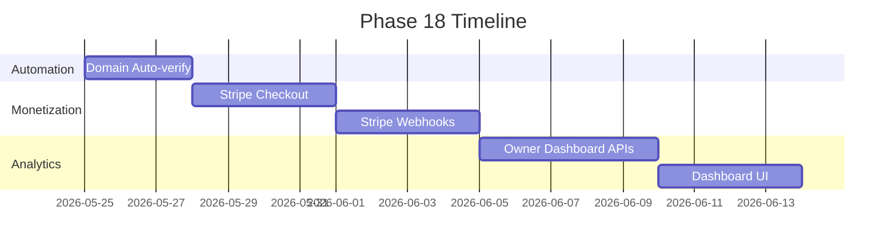

# Phase 18: Revenue Monetization

**Objective**: Complete the monetization loop by launching a fully functional, self-serve "Claim Your Listing" pipeline, integrating Stripe for premium tier subscriptions, and delivering a value-driven Owner Dashboard.

**Success Criteria**:
- Venue owners can claim their listing and be auto-verified if their email domain matches the venue's domain.
- Owners can seamlessly upgrade to Bronze, Silver, or Gold tiers via Stripe Checkout.
- The Owner Dashboard surfaces meaningful traffic analytics (impressions, outbound clicks) to prove ROI.
- Premium venues receive lead generation via direct inquiries.

---

## 1. Automated Verification Pipeline

**Problem**: The current claim flow requires a manual, 24-hour admin review (`venue_claims.admin_approved_at`). This introduces fatal friction in the conversion funnel. 

**Solution**: Leverage the contact data gathered in Phase 17 (High-Velocity Enrichment) to automate approval during the `verifyClaim` step.

**Tasks**:
| Priority | Task | Owner | Effort | Status |
|----------|------|-------|--------|--------|
| P0 | Add `autoApproveClaim(claimId)` logic in `backend/src/services/claimService.ts` | Backend | Medium | ⬜ |
| P0 | Verify email domains against the venue's `website` domain (extracted via `URL` parsing) | Backend | Low | ⬜ |
| P0 | Verify email exact match against enriched `venues.email` column | Backend | Low | ⬜ |
| P1 | Remove `db_query_hack` in `backend/src/controllers/claimController.ts` and replace with proper DB join | Backend | Low | ⬜ |

---

## 2. Stripe Billing Integration

**Problem**: KidSpot cannot currently accept payments. The database supports `sponsor_tier` ('bronze', 'silver', 'gold'), `stripe_customer_id`, and `stripe_subscription_id`, but there is no mechanism to collect funds or handle lifecycle events.

**Solution**: Integrate Stripe Checkout for simple, high-converting subscription creation and use webhooks to sync tier status.

**Tasks**:
| Priority | Task | Owner | Effort | Status |
|----------|------|-------|--------|--------|
| P0 | Implement `POST /api/billing/create-checkout-session` in `backend/src/controllers/billingController.ts` using `stripe.checkout.sessions.create` | Backend | Medium | ⬜ |
| P0 | Implement `POST /api/billing/webhook` to handle `checkout.session.completed` (updates `stripe_subscription_id` and `sponsor_tier`) | Backend | High | ⬜ |
| P0 | Handle `customer.subscription.deleted` to downgrade venues to `sponsor_tier = NULL` | Backend | High | ⬜ |
| P1 | Update `frontend/src/app/venue/[slug]/pricing/page.tsx` to link tier buttons directly to the Checkout Session endpoint | Frontend | Medium | ⬜ |

---

## 3. Owner Analytics Dashboard

**Problem**: Even if owners claim a venue, they won't pay for premium features unless they can see the ROI (traffic and clicks) KidSpot is generating for them.

**Solution**: Expose the metrics already being captured by `outbound_clicks` and `venue_views` tables in a secure Owner Dashboard.

**Tasks**:
| Priority | Task | Owner | Effort | Status |
|----------|------|-------|--------|--------|
| P0 | Create `GET /api/owner/venues` in `backend/src/routes/owner.ts` to list venues matching `claim_email` | Backend | Medium | ⬜ |
| P0 | Create `GET /api/owner/venues/:id/analytics` to return 30-day grouped impression/click stats | Backend | High | ⬜ |
| P1 | Build the `Owner Dashboard` React component (`frontend/src/app/owner/dashboard/page.tsx`) with simple charting | Frontend | High | ⬜ |

---

## 4. Premium Lead Generation

**Problem**: Silver and Gold tiers need a stronger value proposition beyond just "higher ranking" (`sponsor_priority`).

**Solution**: Add a "Contact for Party Hire" feature exclusively for premium tiers, allowing users to send direct inquiries to the venue owner's `claim_email`.

**Tasks**:
| Priority | Task | Owner | Effort | Status |
|----------|------|-------|--------|--------|
| P1 | Add `POST /api/venues/:id/inquire` endpoint (rate-limited via `express-rate-limit`) | Backend | Medium | ⬜ |
| P1 | Implement `emailService.sendPartyInquiry(ownerEmail, message)` in `backend/src/services/emailService.ts` | Backend | Low | ⬜ |
| P2 | Add an inquiry modal on the `VenueDetailContent` component (`frontend/src/components/venues/venue-detail-content.tsx`) for premium venues | Frontend | Medium | ⬜ |

---

## Timeline & Execution

