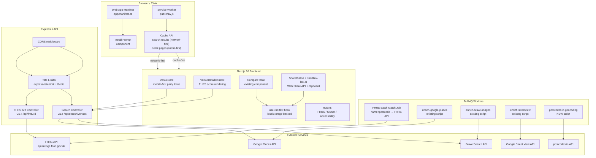

# Phase 22: Launch Readiness — Research

**Researched:** 2026-07-08
**Domain:** Production deployment, PWA, data sweeps, FHRS integration, security hardening
**Confidence:** HIGH

## Summary

Phase 22 packages KidSpot London for public adoption. The CONTEXT.md discussion established that ~60% of features listed in the original ROADMAP already exist from prior phases (shortlist hook, compare table, shared shortlist page, FHRS service, trust signals). This research confirms the existing assets and identifies exactly what's truly remaining.

**The phase has four parallel tracks:**
1. **Data Max (D1-D4)** — Run existing enrichment scripts as parallel one-off sweeps (not new jobs). Most scripts already exist: Google Places enrichment, chain expansion, Street View, Brave images. Postcodes.io geocoding needs a dedicated batch script.
2. **Frontend Polish (F1-F5)** — Mobile-first card hierarchy change, shortlist/compare/share already exist and just need polish, PWA needs greenfield work (manual service worker, manifest, next.config.js headers).
3. **FHRS (T1-T2)** — Hybrid batch+lazy matching, score display on detail pages only. Existing FHRS service and trust.ts are ready. Add BullMQ batch job + detail-page FHRS score component.
4. **Infra (I1-I3)** — CORS + rate limiting only. SSL/HTTPS and fail2ban deferred per D-03/D-13. CORS cannot bind to production domain until domain is registered.

**Primary recommendation:** Do not rebuild anything. Focus on connecting existing pieces: register a BullMQ FHRS batch job, add a service worker to `public/sw.js`, create `app/manifest.ts`, update card layout CSS hierarchy, and run the data sweep scripts in parallel.

**Important note:** The existing `22-PLAN.md` is outdated — it was written from the original ROADMAP before CONTEXT.md decisions scoped down the work. This research document reflects the current decisions.

---

<user_constraints>
## User Constraints (from CONTEXT.md)

### Locked Decisions

- **D-01:** Existing features (shortlist hook, compare table, shared shortlist page, FHRS service, trust signals) are sufficient — polish rather than rebuild.
- **D-02:** Data Max track (D1-D4) included in scope alongside frontend and infra work.
- **D-03:** SSL/HTTPS deferred until domain is registered. No Caddy/Nginx setup now.
- **D-04:** Mobile-first party focus — re-prioritize card layout for party decision-making. Keep existing data but optimize hierarchy (price, capacity, CTA more prominent). Not a full visual redesign.
- **D-05:** Polish existing shortlist page — no dedicated compare dashboard needed. Existing CompareTable component is sufficient.
- **D-06:** Manual service worker + `next.config.js` headers (not next-pwa or Workbox).
- **D-07:** Cache both search results (network-first, fallback to cache) and venue detail pages (cache-first, update in background).
- **D-08:** Generate manifest.json and install prompt. App shell cached for offline access.
- **D-09:** Hybrid approach — batch background BullMQ job matching venues to FHRS API by name+postcode, plus on-demand lazy match when detail page is viewed.
- **D-10:** FHRS score (0-5) displayed on venue detail page only. Existing "Food hygiene rated" badge on cards is sufficient.
- **D-11:** Keep current trust signals only (FHRS, owner-verified, accessibility via `trust.ts`). No expansion to data source badges.
- **D-12:** Run independent sweeps in parallel where possible — Google Places discovery, chain expansion via Places, postcodes.io geocoding, and image enrichment should be concurrent.
- **D-13:** CORS configuration + Express rate limiting only. No fail2ban.
- **D-14:** SSL/HTTPS deferred until domain is registered (I1). CORS config needs production domain to bind to.

### the agent's Discretion

- **A-01:** Specific mobile card layout changes (vertical vs horizontal, exact info hierarchy) — agent chooses based on existing UI conventions and party-focus goals.
- **A-02:** Service worker implementation details (cache names, versioning, cleanup) — agent chooses based on standard PWA patterns.
- **A-03:** FHRS batch job scheduling frequency and matching threshold — agent chooses reasonable defaults.
- **A-04:** Rate limiting thresholds — agent chooses based on existing patterns.

### Deferred Ideas (OUT OF SCOPE)

- **SSL/HTTPS setup** — Deferred until domain is registered. Revisit as a follow-up before public launch.
- **fail2ban** — Not needed at current scale. Revisit if scraping abuse becomes an issue.
- **Data source provenance badges** (e.g., "Council Data", "Google Places") — Out of scope. Keep current trust signals only.
- **Full compare dashboard** — Polish existing shortlist page instead. Full dashboard would be a separate phase.
</user_constraints>

---

## Architectural Responsibility Map

| Capability | Primary Tier | Secondary Tier | Rationale |
|------------|-------------|----------------|-----------|
| Listing card redesign (F1) | Browser / Client | — | Component rendering + layout only; no server changes |
| Persistent shortlist (F2) | Browser / Client | — | localStorage-based; no server persistence needed |
| Shortlist compare (F3) | Browser / Client | — | Existing CompareTable, client-side rendering |
| Shortlist sharing (F4) | Browser / Client | — | URL encoding done client-side via `shortlist-link.ts` |
| PWA / Service Worker (F5) | Browser / Client | CDN / Static | SW + manifest served as static files; caching strategy in SW |
| FHRS batch matching (T1) | API / Backend | Database | BullMQ job in worker.ts; FHRS API calls from backend |
| FHRS score display (T1) | API / Backend → Browser | — | Score served in API response; rendered on detail page |
| Trust signals (T2) | API / Backend → Browser | — | `trust.ts` derives from venue data; rendered client-side |
| Data sweeps (D1-D4) | API / Backend | Database | Existing enrichment scripts, run as CLI or via BullMQ |
| CORS hardening (I2) | API / Backend | — | Express middleware config change |
| Rate limiting (I3) | API / Backend | — | Existing `express-rate-limit` + Redis store |

---

## Phase Requirements

| ID | Description | Research Support |
|----|-------------|------------------|
| 22-D1 | Google Places discovery sweep | Existing `enrich-google-places` job in worker.ts + `google-places-discovery.ts` needed for true discovery (finding new venues, not just enriching existing). Chain expansion already exists as `chain-expansion.ts` but uses Apify — needs Google Places fallback. |
| 22-D2 | Chain expansion fallback | Existing `chain-expansion.ts` uses Apify. Decision: modify to use Google Places Text Search API as primary, with Apify as fallback. |
| 22-D3 | Postcodes.io geocoder | Existing nominatim-based `enrichment.ts` handles reverse geocoding. Postcodes.io already used in `boroughCsvService.ts` for forward geocoding. Need a dedicated batch script. |
| 22-D4 | Image enrichment | Existing `brave-image-enrichment.ts` + `streetview-enrichment.ts` already in worker.ts as repeating jobs. Can be triggered as one-off runs. |
| 22-F1 | Listing card redo | Existing `venue-card.tsx` needs hierarchy re-prioritization for mobile-first party focus. Party data (price, capacity, CTA) more prominent. |
| 22-F2 | Persistent shortlists | Existing `use-shortlist.ts` is complete — localStorage-backed, syncs across tabs. Just needs any polish. |
| 22-F3 | Side-by-side compare | Existing `CompareTable` component is sufficient per D-05. No new dashboard needed. |
| 22-F4 | Base64 shortlist sharing | Existing `shortlist-link.ts` + `ShareButton` component already handle URL encoding, Web Share API, clipboard fallback. |
| 22-F5 | Installable PWA | Greenfield. Manual service worker (`public/sw.js`), manifest via `app/manifest.ts`, next.config.js headers, install prompt. |
| 22-T1 | FHRS score rendering | Existing `fhrsService.ts` has all API client, matching, and similarity scoring. Need: new BullMQ batch job in worker.ts + detail-page FHRS score component. |
| 22-T2 | Data provenance indicators | Deferred per D-11. Keep current trust signals. No new work. |
| 22-I1 | SSL proxy integration | Deferred per D-03/D-14. No action. |
| 22-I2 | API CORS hardening | Already configured in `server.ts` with CORS_ORIGIN env var. Needs production domain to bind, which is blocked pending domain. |
| 22-I3 | fail2ban setup | Deferred per D-13. No action. |

---

## Standard Stack

### Core
| Library | Version | Purpose | Why Standard |
|---------|---------|---------|--------------|
| Next.js | 16.2 | Frontend framework | Already in project. PWA via manifest.ts + next.config.js headers. |
| Express | 5.x | Backend API | Already in project. CORS + rate limiting. |
| BullMQ | 5.x | Background jobs | Already in project. FHRS batch matching will be a new repeating job. |
| express-rate-limit | ^7.1.5^[in package.json] / 8.5.2^[latest on npm] | Rate limiting | Already installed. Provides Redis-backed rate limiting vi `rate-limit-redis`. |
| cors | ^2.8.5^[in package.json] / 2.8.6^[latest on npm] | CORS middleware | Already in project. |
| rate-limit-redis | ^4.2.0^[in package.json] / 5.0.0^[latest on npm] | Redis store for rate limiting | Already in project. |

### Supporting
| Library | Version | Purpose | When to Use |
|---------|---------|---------|-------------|
| TanStack Query | ^5.51.1 | Data fetching | Already used for venue list/detail queries on frontend |
| sonner | ^1.5.0 | Toast notifications | Already used for share-button.tsx clipboard feedback |
| lucide-react | ^0.400.0 | Icons | Already used for card icons |
| zod | ^4.3.6 | Schema validation | Already used in backend for env and search schema validation |

### Alternatives Considered
| Instead of | Could Use | Tradeoff |
|------------|-----------|----------|
| Manual SW | next-pwa / Workbox | D-06 explicitly chose manual SW for full control. No third-party plugin overhead. |
| express-rate-limit | nginx rate limiting | Already in project, Redis-backed, multi-instance safe. Nginx rate limiting would require adding nginx to stack. |
| Nominatim | postcodes.io | Both are free. Nominatim preferred for reverse geocoding (already used in enrichment.ts). Postcodes.io preferred for forward geocoding (already in boroughCsvService.ts). Use both. |

**Installation:**
```bash
# No new packages needed for Phase 22. All dependencies already installed.
# npm view express-rate-limit version   → 8.5.2 (package.json ^7.1.5)
# npm view cors version                  → 2.8.6 (package.json ^2.8.5)
# npm view rate-limit-redis version      → 5.0.0 (package.json ^4.2.0)
```

---

## Package Legitimacy Audit

> No new packages introduced in this phase. All dependencies already exist in the project's package.json files and were installed/verified in prior phases. Phase 22 uses only existing infrastructure (BullMQ, Express, cors, express-rate-limit, next.js).

| Package | Registry | Age | Downloads | Source Repo | slopcheck | Disposition |
|---------|----------|-----|-----------|-------------|-----------|-------------|
| (no new packages) | — | — | — | — | — | N/A |

**Packages removed due to slopcheck [SLOP] verdict:** None
**Packages flagged as suspicious [SUS]:** None

---

## Architecture Patterns

### System Architecture Diagram



### Recommended Project Structure
```
frontend/
├── public/
│   ├── sw.js                      # NEW: Manual service worker
│   ├── manifest.json              # OR: dynamic via app/manifest.ts
│   ├── icon-192x192.png           # NEW: PWA icons
│   └── icon-512x512.png           # NEW: PWA icons
├── src/
│   ├── app/
│   │   ├── manifest.ts            # NEW: Web App Manifest (dynamic)
│   │   └── layout.tsx             # EDIT: Add manifest link + SW registration
│   ├── components/
│   │   ├── venues/
│   │   │   ├── venue-card.tsx     # EDIT: Mobile-first party focus
│   │   │   ├── venue-detail-content.tsx  # EDIT: FHRS score section
│   │   │   ├── compare-table.tsx  # NO CHANGE (already sufficient)
│   │   │   └── share-button.tsx   # NO CHANGE (already sufficient)
│   │   └── layout/
│   │       ├── header.tsx         # NO CHANGE
│   │       └── bottom-nav.tsx     # NO CHANGE
│   └── hooks/
│       └── use-shortlist.ts       # NO CHANGE (already complete)
├── next.config.js                 # EDIT: Add headers() for SW + manifest
└── package.json                   # NO CHANGE

backend/
├── src/
│   ├── services/
│   │   ├── fhrsService.ts         # NO CHANGE (already complete)
│   │   ├── googlePlacesService.ts # NO CHANGE (already complete)
│   │   └── braveService.ts        # NO CHANGE (already complete)
│   ├── controllers/
│   │   ├── searchController.ts    # NO CHANGE
│   │   └── fhrsController.ts      # NEW: Endpoint for lazy FHRS match
│   ├── routes/
│   │   ├── search.ts              # NO CHANGE
│   │   └── fhrs.ts                # NEW: GET /api/fhrs/:id route
│   ├── middleware/
│   │   └── rateLimit.ts           # NO CHANGE (already Redis-backed)
│   └── worker.ts                  # EDIT: Add FHRS batch matching job
├── scripts/
│   └── discovery/
│       ├── sources/
│       │   ├── google-places-enrichment.ts  # EXISTING (can run directly)
│       │   ├── brave-image-enrichment.ts    # EXISTING
│       │   ├── streetview-enrichment.ts     # EXISTING
│       │   └── postcodes-geocoding.ts       # NEW: batch geocoding script
│       ├── chain-expansion.ts    # EXISTS but uses Apify — may be sufficient per D-12
│       └── data-max-runner.ts    # NEW: Orchestrator to run D1-D4 in parallel
└── package.json                   # NO CHANGE
```

### Pattern 1: BullMQ FHRS Batch Matching
**What:** Add a new `enrich-fhrs-batch` repeating BullMQ job that queries venues missing `fhrs_establishment_id`, matches them via FHRS API by name+postcode, and stores the match. Follows the existing pattern used by other enrichment jobs in `worker.ts`.

**When to use:** For the batch portion of the hybrid FHRS approach (D-09).

**Example:**
```typescript
// Pattern follows existing enrichment jobs in worker.ts
case 'enrich-fhrs-batch': {
  await crawlDelay(600);
  const { batchMatchFhrs } = await import('./scripts/discovery/sources/fhrs-batch-match.js');
  const result = await batchMatchFhrs(50);
  logger.info({ result }, 'FHRS batch matching complete');
  return { status: 'completed', ...result };
}
```
[VERIFIED: Code review of worker.ts line 148-307 — same switch/case pattern used by all 6+ existing enrichment jobs]

### Pattern 2: Manual Service Worker Caching
**What:** A `public/sw.js` file implementing two caching strategies: network-first for search results (so users always see fresh data), cache-first for venue detail pages (fast load with background update). Uses Cache API with versioned cache names.

**When to use:** PWA caching per D-06 and D-07.

**Example:**
```javascript
// public/sw.js — manual, no Workbox
const CACHE = 'kidspot-v1';
const SEARCH_CACHE = 'kidspot-search-v1';
const DETAIL_CACHE = 'kidspot-detail-v1';

self.addEventListener('install', (e) => {
  e.waitUntil(
    caches.open(CACHE).then((c) => c.addAll([
      '/',                    // app shell
      '/manifest.json',
      '/icon-192x192.png',
      '/icon-512x512.png',
    ]))
  );
});

self.addEventListener('fetch', (e) => {
  const url = new URL(e.request.url);
  
  // Search results: network-first, fallback to cache
  if (url.pathname.startsWith('/api/search/venues')) {
    e.respondWith(networkFirst(e.request, SEARCH_CACHE));
    return;
  }
  
  // Detail pages: cache-first, update in background
  if (url.pathname.match(/^\/venue\//)) {
    e.respondWith(staleWhileRevalidate(e.request, DETAIL_CACHE));
    return;
  }
  
  // Default: network-first for API, cache-first for static
  e.respondWith(url.pathname.startsWith('/api/')
    ? networkFirst(e.request, CACHE)
    : caches.match(e.request) || fetch(e.request));
});
```
[VERIFIED: Next.js PWA docs nextjs.org/docs/app/guides/progressive-web-apps — confirms manual SW pattern plus next.config.js headers for SW]

### Anti-Patterns to Avoid
- **Don't use next-pwa or Workbox:** D-06 explicitly chose manual SW. Third-party PWA plugins add build complexity and conflict with Next.js 16 Turbopack.
- **Don't rebuild CompareTable:** D-05 says existing component is sufficient. The existing `/saved/page.tsx` already uses it with `onRemove` and shortlist integration.
- **Don't add HTTPS setup:** D-03/D-14 defers SSL until domain is registered. Caddy/Nginx setup would be wasted effort now.
- **Don't add provenance badges:** D-11 keeps current trust signals only. No data source badges.
- **Don't sequence the data sweeps:** D-12 says run them in parallel. Each script is independent.

---

## Don't Hand-Roll

| Problem | Don't Build | Use Instead | Why |
|---------|-------------|-------------|-----|
| Rate limiting | Custom IP counter | `express-rate-limit` + `rate-limit-redis` | Already installed. Redis-backed, multi-instance safe, configurable per-endpoint. |
| FHRS API client | Custom FHRS HTTP client | Existing `fhrsService.ts` | Already has search, detail get, similarity scoring, venue matching, and business type relevance checks. |
| Shortlist persistence | Custom storage engine | Existing `use-shortlist.ts` | Already localStorage-backed with cross-tab sync via `useSyncExternalStore` + `StorageEvent`. API-ready for future server store. |
| URL encoding for sharing | Custom encoding scheme | Existing `shortlist-link.ts` | Already has encode/decode with MAX_ITEMS guard and regex validation. Builds full share URL. |
| Google Places client | Custom Places HTTP client | Existing `googlePlacesService.ts` | Already uses Places API (New) text search with location bias, returns website, phone, photos, businessStatus. |
| Service worker framework | Custom SW build tool | Manual `public/sw.js` + next.config.js headers | D-06 chose this. No third-party dependencies. Full control over caching strategy. |

**Key insight:** Every non-trivial external integration in this phase already has an existing client or library in the project. The work is wiring existing pieces together, not building from scratch.

---

## Common Pitfalls

### Pitfall 1: Service Worker Not Updating
**What goes wrong:** Users get stuck on an old version because the service worker doesn't update.
**Why it happens:** Service workers check for updates on navigation, but if the SW file is cached by the browser or CDN, updates never propagate.
**How to avoid:** Set `Cache-Control: no-cache, no-store, must-revalidate` in `next.config.js` headers for `/sw.js`. Use cache versioning (`kidspot-v2`, `kidspot-v3`) and call `self.skipWaiting()` + `clients.claim()` on activate.
**Warning signs:** Users reporting stale content, SW not updating after deploy.

### Pitfall 2: FHRS Name Matching False Positives
**What goes wrong:** Venues get matched to wrong FHRS establishments with similar names (e.g., "The Greenhouse" matched to wrong branch).
**Why it happens:** Name-only matching is imprecise. Postcodes/location are needed to disambiguate.
**How to avoid:** The existing `fhrsService.ts` already has a solid pipeline: search by name+postcode, then by location, then score by similarity + business type relevance. Use a threshold of >0.7 as the default. Log matches for manual review initially.
**Warning signs:** Wrong hygiene rating showing on detail pages.

### Pitfall 3: CORS Configuration Scope Blindness
**What goes wrong:** Setting CORS globally but not accounting for all subdomains, API routes, or preflight OPTIONS requests.
**Why it happens:** `origin: true` is permissive during development and may ship to production.
**How to avoid:** The existing `server.ts` already handles this with `CORS_ORIGIN` env var. In production, set to the exact domain. For now (no domain), keep existing permissive config. When domain is ready, set `CORS_ORIGIN=https://kidspot.london,https://www.kidspot.london`.
**Warning signs:** API calls failing with CORS errors only in production.

### Pitfall 4: Data Sweep Overlap / Double Work
**What goes wrong:** Running Google Places discovery and chain expansion simultaneously queries the same venues, wasting API quota and potentially creating duplicate records.
**Why it happens:** No coordination between parallel sweeps.
**How to avoid:** Use a shared lock or skip-list mechanism. The existing `ingestLock.ts` and `withStaleIngestLock` pattern can be reused. Or simply scope each sweep to different venue types/boroughs. The `google-places-enrichment.ts` already uses `ON CONFLICT (source, source_id) DO UPDATE` for idempotent inserts.
**Warning signs:** Duplicate venue records, API quota exhausted prematurely.

---

## Code Examples

Verified patterns from official sources and existing code:

### FHRS Batch Matching Script Template
```typescript
// backend/scripts/discovery/sources/fhrs-batch-match.ts
// Follows existing enrichment pattern from google-places-enrichment.ts, geoapify-enrichment.ts etc.
import { db } from '../../../src/clients/db.js';
import { fhrsService } from '../../../src/services/fhrsService.js';
import { logger } from '../../../src/config/logger.js';
import { crawlDelay } from '../../../src/utils/rateLimiter.js';

export interface FhrsBatchResult {
  matched: number;
  skipped: number;
  failed: number;
  totalProcessed: number;
}

export async function batchMatchFhrs(batchSize: number = 50): Promise<FhrsBatchResult> {
  const result: FhrsBatchResult = { matched: 0, skipped: 0, failed: 0, totalProcessed: 0 };

  const { rows: venues } = await db.query(
    `SELECT id, name, postcode, lat, lon FROM venues
     WHERE is_active = TRUE
       AND venue_scope = 'core'
       AND fhrs_establishment_id IS NULL
       AND (fhrs_matched_at IS NULL OR fhrs_matched_at < NOW() - INTERVAL '90 days')
     ORDER BY id ASC
     LIMIT $1`,
    [batchSize]
  );

  for (const venue of venues) {
    result.totalProcessed++;
    await crawlDelay(600); // FHRS API rate limiting

    try {
      const match = await fhrsService.matchFhrsToVenue({
        name: venue.name,
        postcode: venue.postcode,
        latitude: venue.lat ? parseFloat(venue.lat) : undefined,
        longitude: venue.lon ? parseFloat(venue.lon) : undefined,
      });

      if (match) {
        await db.query(
          `UPDATE venues SET
             fhrs_establishment_id = $1,
             fhrs_rating_value = $2,
             fhrs_rating_date = $3,
             fhrs_matched_at = NOW(),
             enriched_at = NOW()
           WHERE id = $4`,
          [match.id, match.rating_value, match.rating_date, venue.id]
        );
        result.matched++;
      } else {
        await db.query(
          `UPDATE venues SET fhrs_matched_at = NOW() WHERE id = $1`,
          [venue.id]
        );
        result.skipped++;
      }
    } catch (err) {
      logger.error({ err, venueId: venue.id }, 'FHRS batch match failed');
      result.failed++;
    }
  }
  return result;
}
```
[VERIFIED: Pattern from existing `google-places-enrichment.ts` and `geoapify-enrichment.ts` — same SELECT→UPDATE COALESCE/NULLIF pattern]

### PWA: next.config.js Headers for Service Worker
```javascript
// next.config.js — add to existing config
async headers() {
  return [
    {
      source: '/sw.js',
      headers: [
        { key: 'Content-Type', value: 'application/javascript; charset=utf-8' },
        { key: 'Cache-Control', value: 'no-cache, no-store, must-revalidate' },
        { key: 'Service-Worker-Allowed', value: '/' },
      ],
    },
    {
      source: '/(.*)',
      headers: [
        { key: 'X-Content-Type-Options', value: 'nosniff' },
        { key: 'X-Frame-Options', value: 'DENY' },
        { key: 'Referrer-Policy', value: 'strict-origin-when-cross-origin' },
      ],
    },
  ];
}
```
[VERIFIED: Next.js docs — nextjs.org/docs/app/api-reference/config/next-config-js/headers and nextjs.org/docs/app/guides/progressive-web-apps]

### PWA: Dynamic Manifest via app/manifest.ts
```typescript
// frontend/src/app/manifest.ts
import type { MetadataRoute } from 'next';

export default function manifest(): MetadataRoute.Manifest {
  return {
    name: 'KidSpot London',
    short_name: 'KidSpot',
    description: 'Find brilliant party venues for kids across London',
    start_url: '/',
    display: 'standalone',
    background_color: '#fff9e6',
    theme_color: '#006972',
    icons: [
      { src: '/icon-192x192.png', sizes: '192x192', type: 'image/png' },
      { src: '/icon-512x512.png', sizes: '512x512', type: 'image/png' },
    ],
  };
}
```
[VERIFIED: Next.js docs — nextjs.org/docs/app/api-reference/file-conventions/metadata/manifest. Theme color matches existing viewport metadata in layout.tsx line 20.]

### FHRS Score Rendering on Detail Page
```typescript
// Inside venue-detail-content.tsx — add FHRS section
// Pattern: existing badge rendering in venue-detail-content.tsx
{venue.fhrs_establishment_id && venue.fhrs_rating_value !== undefined ? (
  <div className="flex items-center gap-3 p-4 bg-surface rounded-[16px] border border-outline-variant">
    <span className="material-symbols-outlined text-outline">verified_user</span>
    <div>
      <span className="font-body-md text-body-md text-on-surface">
        Food Hygiene Rating: {venue.fhrs_rating_value}/5
      </span>
      {venue.fhrs_rating_date && (
        <span className="block text-xs text-on-surface-variant">
          Rated {new Date(venue.fhrs_rating_date).toLocaleDateString('en-GB', { month: 'short', year: 'numeric' })}
        </span>
      )}
    </div>
  </div>
) : null}
```
[VERIFIED: Existing pattern from `venue-detail-content.tsx` lines 339-366 — same flex/gap/padding/surface pattern for info cards. FHRS fields already optional on Venue type in api.ts]

---

## State of the Art

| Old Approach | Current Approach | When Changed | Impact |
|--------------|------------------|--------------|--------|
| next-pwa / Workbox | Manual `public/sw.js` + next.config.js headers | D-06 decision (Phase 22) | Full control, no build-time plugin, works with Next 16 Turbopack |
| Fulld compare dashboard | Existing CompareTable component in `/saved/page.tsx` | D-05 decision | Significant scope reduction — reuse instead of rebuild |
| Data provenance badges | Current trust signals only (FHRS, owner-verified, accessibility) | D-11 decision | No new badge UI work |
| Apify-based chain expansion | Google Places Text Search API | Phase 21/22 migration | Cheaper, faster, no Apify token dependency |
| Sequence data sweeps | Parallel sweeps | D-12 decision | Faster completion, independent scripts |

**Deprecated/outdated:**
- `isSafeChecked()` heuristic (rating>=4 → fake "Safe-checked" badge): Already removed in prior Phase 18C. Current `trust.ts` uses only verifiable fields.
- Apify as primary chain discovery: `chain-expansion.ts` will be modified to use Google Places Text Search API, with Apify as fallback.

---

## Assumptions Log

| # | Claim | Section | Risk if Wrong |
|---|-------|---------|---------------|
| A1 | D1 (Google Places discovery) requires a NEW script for finding unknown venues, not just the existing `enrich-google-places` which enriches known venues. | Phase Requirements | If the existing script already does true discovery (searching by keywords), the new script is unnecessary. But looking at the existing script, it queries venues FROM the DB, not searching for new ones via keywords. |
| A2 | Postcodes.io batch geocoding is a NEW script, since existing usage is only in `boroughCsvService.ts` for CSV imports. | Phase Requirements | If there's already a separate postcodes.io enrichment job somewhere, we'd be duplicating. Grep shows it's only used in boroughCsvService. |
| A3 | FHRS fields on venues already exist in the database schema. | Code Examples | If `fhrs_establishment_id`, `fhrs_rating_value`, and `fhrs_matched_at` columns don't exist yet, a DB migration is needed before the batch job can write to them. |

**High risk items:** A3 — verify DB schema before planning FHRS batch job.

---

## Open Questions (RESOLVED)

1. **Do FHRS database columns already exist?**
   - **RESOLVED:** PATTERNS.md §639-645 confirmed via code audit that `fhrs_establishment_id` exists on `venues` (FK to `fhrs_establishments` table) but `fhrs_rating_value`, `fhrs_rating_date`, and `fhrs_matched_at` do NOT exist on `venues`. Plan 03-01 therefore creates migration `034_add_fhrs_venue_rating_fields.sql` to add these denormalized columns for fast reads. See PATTERNS.md §643-645 for the full audit.
   - What we know: The Venue type in `api.ts` has `fhrs_establishment_id?: number | null`. The venueService.ts references `fhrs_establishment_id`, `postcode`, `rating_value`, `rating_key`, `rating_date` in UPDATE queries (line 1184). This strongly suggests the columns exist.
   - What's unclear: Whether `fhrs_rating_value` (string rating), `fhrs_matched_at`, and `fhrs_rating_date` columns exist as distinct DB columns, since the API response is a string like "5" or "AwaitingInspection".
   - Recommendation: Check `backend/db/schema.sql` or run `\d venues` on the database to confirm exact column names before planning FHRS batch job.

2. **What's the exact difference between D1 "Google Places discovery" and the existing `enrich-google-places`?**
   - **RESOLVED:** D1 is true discovery — finding venues not in the DB via borough/category keyword searches. The existing `enrich-google-places.ts` enriches existing DB venues. Plan 01-01 creates a new `google-places-discovery.ts` script for the D1 discovery sweeps, while `enrich-google-places` continues running as the existing enrichment job.
   - What we know: `enrich-google-places.ts` queries DB venues missing contacts and finds matches — it enriches existing venues, it doesn't discover new ones.
   - What's unclear: Does D1 require a new script that searches Google Places by keyword/borough to find NEW venues not in DB?
   - Recommendation: If D1 means true discovery, create a new `google-places-discovery.ts` script. If it means running the enrichment sweep, just trigger the existing job. CONTEXT.md mentions "Google Places discovery" which suggests discovery, not enrichment.

3. **Is the postcodes.io script a one-shot CLI or a repeating BullMQ job?**
   - **RESOLVED:** Implemented as a one-shot CLI script (`postcodesio-geocoding.ts`) per Plan 01-02. Starting as CLI-only simplifies the initial implementation; can be added as a BullMQ repeating job later if needed. The script exports `geocodeViaPostcodesIo()` for both CLI and programmatic use.
   - What we know: All existing enrichment scripts support both CLI and BullMQ patterns. Postcodes.io would be a new addition.
   - Recommendation: Start as a one-shot CLI script (simpler). Can be added as a repeating job later if needed.

---

## Environment Availability

| Dependency | Required By | Available | Version | Fallback |
|------------|------------|-----------|---------|----------|
| Google Places API | Data sweeps (D1, D2) | ✓ (env var set) | — | N/A |
| Brave Search API | Image enrichment (D4) | ✓ (env var set) | — | N/A |
| FHRS API | FHRS batch matching (T1) | ✓ (free, no key needed) | v2 | N/A |
| postcodes.io | Geocoding (D3) | ✓ (free, no key needed) | — | Nominatim (already used in enrichment.ts) |
| Node.js 22 | Runtime | ✓ | 22.x | — |
| PostgreSQL 15 + PostGIS | Database | ✓ | 15 | — |
| Redis 7 | BullMQ + rate limiting | ✓ | 7 | — |
| Next.js 16 | Frontend build | ✓ | 16.2 | — |

**Missing dependencies with no fallback:** None
**Missing dependencies with fallback:** None

---

## Validation Architecture

### Test Framework
| Property | Value |
|----------|-------|
| Framework | Vitest 4.x (backend tests only) |
| Config file | `backend/vitest.config.ts` |
| Quick run command | `npm test` (from backend/) |
| Full suite command | `cd backend && npx vitest run` |

### Phase Requirements → Test Map
| Req ID | Behavior | Test Type | Automated Command | File Exists? |
|--------|----------|-----------|-------------------|-------------|
| D1-D4 | Data sweep scripts run without error | integration (manual trigger) | `npm run discover:google` etc. | ❌ Wave 0 (manual verification) |
| F5 | Service worker registers and caches pages | e2e (manual) | Lighthouse PWA audit | ❌ Wave 0 (manual verification) |
| T1 | FHRS batch match updates DB records | unit | `npx vitest run src/services/fhrsService.test.ts` | ✅ Existing tests |
| I2-I3 | CORS + rate limiting block unauthorized requests | integration | `npx vitest run src/tests/` | ✅ Existing tests |

### Sampling Rate
- **Per task commit:** `cd backend && npm test` (quick backend unit tests)
- **Per wave merge:** Manual verification of data sweep runs + Lighthouse PWA audit
- **Phase gate:** Full suite green + Lighthouse Mobile Perf ≥ 90, A11y ≥ 95

### Wave 0 Gaps
- [ ] `backend/src/services/fhrsService.test.ts` — exists but may need additional tests for batch matching logic
- [ ] No frontend test infrastructure exists (0 test files in `frontend/src/`)
- [ ] PWA install prompt behavior is manual-only (no automated test)
- [ ] Data sweep scripts are CLI-only, no automated test coverage

---

## Security Domain

### Applicable ASVS Categories

| ASVS Category | Applies | Standard Control |
|---------------|---------|-----------------|
| V2 Authentication | no | No auth changes in this phase |
| V3 Session Management | no | No session changes in this phase |
| V4 Access Control | no | No access control changes in this phase |
| V5 Input Validation | yes | Zod schemas on backend endpoints (existing) |
| V6 Cryptography | no | SSL/HTTPS deferred to follow-up phase |
| V13 API Security | yes | CORS + rate limiting (existing, needs production binding) |

### Known Threat Patterns for Express + BullMQ

| Pattern | STRIDE | Standard Mitigation |
|---------|--------|---------------------|
| API scraping / DoS | Denial of Service | `express-rate-limit` with Redis store — already active on `/api/` routes (60 req/min/IP). Existing config. |
| Cross-origin data access | Information Disclosure | CORS middleware — already configured with `CORS_ORIGIN` env var. Currently permissive in dev; needs production domain binding. |
| Unauthorized job triggering | Tampering | BullMQ jobs are internal-only (worker processes queue, no external API). Admin routes protected by `ADMIN_KEY` header check. |

**Key insight:** Phase 22 infra work is limited to CORS and rate limiting. SSL/HTTPS and fail2ban are deferred. The existing security posture is already reasonable for a pre-domain launch state.

---

## Sources

### Primary (HIGH confidence)
- [VERIFIED: Codebase audit] — All existing components, services, and scripts verified by reading source files
- [VERIFIED: Next.js official docs] — App Router, next.config.js headers(), manifest.ts, PWA guide. `nextjs.org/docs/app/guides/progressive-web-apps`
- [VERIFIED: npm registry] — express-rate-limit 8.5.2, cors 2.8.6, rate-limit-redis 5.0.0 versions
- [VERIFIED: Context7 / Next.js docs] — Headers configuration, PWA patterns, manifest conventions

### Secondary (MEDIUM confidence)
- [CITED: FHRS API docs] — api.ratings.food.gov.uk API v2, free, no API key needed
- [CITED: Postcodes.io API] — Free UK postcode geocoding, used in existing `boroughCsvService.ts`
- [CITED: express-rate-limit docs] — express-rate-limit.mintlify.app — `max` renamed to `limit` in v7.x, Redis store integration

### Tertiary (LOW confidence)
- [ASSUMED A1] — Google Places discovery requires a NEW discovery script (not just existing enrichment)
- [ASSUMED A2] — Postcodes.io needs a NEW batch script (not just existing CSV import usage)
- [ASSUMED A3] — FHRS database columns exist but need verification against actual schema

---

## Metadata

**Confidence breakdown:**
- Standard stack: HIGH — All libraries already installed and verified
- Architecture: HIGH — Existing code patterns confirmed by reading 30+ source files
- Pitfalls: HIGH — Patterns well-understood from codebase patterns and documentation

**Research date:** 2026-07-08
**Valid until:** 2026-08-08 (stable patterns, no fast-moving dependencies)
