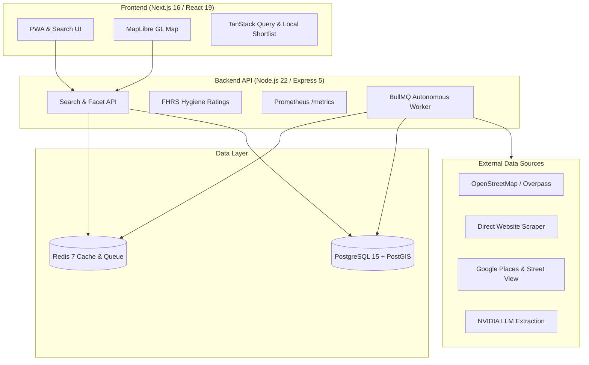

# KidSpot London 🇬🇧


**KidSpot London** is an open-source, party-first venue discovery platform designed to help parents in Greater London find, compare, and book birthday party venues, soft plays, community halls, and family event spaces.

Unlike raw OpenStreetMap or general Google Maps listings, KidSpot London uses a targeted **core party catalogue** combined with an **autonomous 24/7 data enrichment engine** that extracts party-specific pricing, capacity limits, high-resolution photo galleries, and food hygiene trust signals.

---

## 📌 Project Status (August 2026)

The platform is **98% complete and production-ready** on IP (`79.72.92.195:3005`). 

| Component | Status | Details |
|:---|:---:|:---|
| **Product & UX** | ✅ Complete | Mobile-first party UI, dynamic shortlist, side-by-side comparison, PWA support, interactive map. |
| **Core Catalogue** | ✅ Complete | **2,383 core venues**, 196 party-capable core venues (16,304 active venues). |
| **Image Coverage** | ✅ Complete | High-intent coverage: **97.6%** soft plays · **88.2%** party-capable venues · **31.3%** all core venues (746 venues). |
| **Contact Coverage** | ✅ Complete | Core: **82.5%** websites (1,965) · **67.1%** phones (1,599) · **99.96%** postcodes (2,382). |
| **Trust Signals** | ✅ Complete | Mounted FHRS food hygiene rating API (`GET /api/fhrs/match/:id`). |
| **Enrichment Engine** | ✅ Complete | 42 BullMQ repeatable background jobs running continuously. |
| **Automated Workflows** | ✅ Complete | GitHub Actions crons for hourly enrichment, daily discovery, and automated backups. |
| **Remaining Launch Gaps** | ⚠️ Phase 23 | Point `kidspot.london` DNS, enable HTTPS in Caddy, configure offsite S3/R2 backup replication. |

**Planning Documents:** [`.planning/STATE.md`](.planning/STATE.md) · [`.planning/ROADMAP.md`](.planning/ROADMAP.md) · [`NEXT_ACTIONS.md`](NEXT_ACTIONS.md)

---

## 🏗 Architecture Overview



---

## 🌟 Key Features

* **Party-First Search Filtering:** Defaults to curated `core` party venues (soft plays, leisure centres, halls), hiding raw park listings unless explicitly requested via `include_parks=true`.
* **Food & Birthday Cake Policy Transparency:** Instant clarity on venue catering rules (BYO self-catering vs in-house food packages), kitchen/fridge amenities for halls, and explicit *"Bring your own cake & candles welcome"* reassurance.
* **Interactive Parent Party Checklist:** Persistent, interactive planning checklist widget on Shortlist and Saved pages to help parents track deposits, cakes, catering, party bags, and tea/coffee for attending adults.
* **Multi-Tiered Image Enrichment:** Automated pipeline combining Google Places CDN photos, direct Cheerio OpenGraph/hero scraping, Brave Search, Google Street View, and Wikimedia Commons.
* **Category Gradient Fallbacks:** Venues without imagery render category-themed pastel gradient badges in the UI.
* **Autonomous Enrichment Engine:** Background BullMQ worker running geocoding, contact backfill, opening hours parsing, and party field extraction (pricing, capacity, booking URL).
* **Side-by-Side Venue Comparison:** Compare pricing, capacity, contact options, catering rules, and trust signals in a clean comparative table.
* **Shareable Shortlist:** Share saved venues via lightweight URL parameters (`/shortlist?v=slug1,slug2`) server-validated against API data.
* **PWA & Offline Capability:** Progressive Web App with service worker caching for offline search and venue detail viewing.
* **FHRS Food Hygiene Ratings:** Official UK FSA hygiene scores integrated directly into venue detail cards.
* **Programmatic SEO:** Automated borough and venue-category landing pages covering 33 London Boroughs.

---

## 📊 Platform Scale (Production Snapshot)

| Metric | Value |
|:-------|------:|
| **Total Venues in Database** | 17,045 |
| **Active Venues** | 16,304 |
| **Core Party Catalogue (`venue_scope=core`)** | 2,383 |
| **Party-Capable Core Venues** | 196 (8.2%) |
| **Core Venues with Photos** | **746 (31.3%)** |
| **Core Website Coverage** | 82.5% (1,965 venues) |
| **Core Phone Coverage** | 67.1% (1,599 venues) |
| **Core Postcode Coverage** | 99.96% (2,382 venues) |

### 🖼️ Image Coverage by Category

| Category | Active Count | Venues with Images | Completion % |
|:---|:---|:---|:---|
| **Soft Play** | 84 | 82 | **97.6%** 🟢 |
| **Party-Capable (All)** | 238 | 210 | **88.2%** 🟢 |
| **Libraries** | 47 | 22 | **46.8%** 🟡 |
| **Community Halls** | 1,872 | 423 | **22.6%** 🟠 |
| **Activity Centres / Other** | 494 | 151 | **30.6%** 🟠 |
| **Leisure Centres** | 5,097 | 39 | **0.8%** 🔴 |
| **Parks** | 8,464 | 49 | **0.6%** 🔴 |

> **Note on images:** High-intent party venues (soft plays and party-capable halls) are **88–98%** covered. Bulk geo records (OSM park polygons and leisure facilities) fall back to category-themed pastel gradient badges in the UI. Live numbers: `GET /api/admin/enrichment-stats` (HMAC) or SQL in `backend/scripts/maintenance/`.

---

## 🛠 Tech Stack

### Frontend
- **Framework:** Next.js 16 (App Router, Turbopack, React 19)
- **Styling:** Vanilla CSS & Tailwind CSS 3.4
- **Maps:** MapLibre GL JS
- **State & Data Fetching:** TanStack Query (React Query)
- **Analytics:** Plausible Analytics

### Backend
- **Runtime:** Node.js 22, Express 5, TypeScript
- **Database:** PostgreSQL 15 with PostGIS geospatial extension
- **Caching & Queues:** Redis 7, BullMQ
- **Logging & Metrics:** Pino, Pino HTTP, Prometheus metrics

### Data & External APIs
- **OpenStreetMap / Overpass:** POI discovery & boundary coordinates
- **Cheerio & LLM Pipeline:** Direct website crawling & NVIDIA LLM extraction fallback
- **Geoapify & Foursquare:** Secondary POI matching and contact verification
- **FHRS (Food Standards Agency):** Hygiene rating integration
- **Postcodes.io:** Batch forward and reverse geocoding

---

## 🚀 Getting Started

### Prerequisites
- Node.js >= 22.0.0
- Docker & Docker Compose
- Git

### Local Development Setup

1. **Clone the Repository**
   ```bash
   git clone https://github.com/CiscoPonce/kidspot-london.git
   cd kidspot-london
   ```

2. **Environment Configuration**
   ```bash
   cp .env.example .env
   ```
   *Update minimum required secrets in `.env`: `DB_PASSWORD`, `REDIS_PASSWORD`, `INGEST_SIGNING_SECRET`.*

3. **Launch Docker Services**
   ```bash
   docker compose up -d --build
   ```

4. **Run Database Migrations**
   ```bash
   for f in backend/db/migrations/*.sql; do
     docker compose exec -T postgres psql -U kidspot_admin -d kidspot < "$f"
   done
   ```

5. **Run Application Tests**
   ```bash
   # Backend tests & typecheck
   cd backend
   npm test
   npm run typecheck

   # Frontend typecheck
   cd ../frontend
   npx tsc --noEmit
   ```

6. **Access Local Instances**
   - **Frontend App:** [http://localhost:3005](http://localhost:3005)
   - **Backend API:** [http://localhost:4000/api/search/venues?borough=Hackney](http://localhost:4000/api/search/venues?borough=Hackney)
   - **Health Check:** [http://localhost:4000/health](http://localhost:4000/health)

---

## 🔍 API Reference

### Public Search Endpoints

| Method | Endpoint | Description |
|:---|:---|:---|
| `GET` | `/api/search/venues` | Search venues by `lat`/`lon`, `radius`, `borough`, or `type`. Scope defaults to `core`. |
| `GET` | `/api/search/venues/slug/:slug/details` | Detailed venue payload including photos, pricing, and contact options. |
| `GET` | `/api/search/facets/venues` | Multi-facet aggregation query. |
| `GET` | `/api/search/slugs` | Fetch all active venue slugs for programmatic SEO generation. |
| `POST` | `/api/search/venues/:id/click` | Outbound contact click tracking. |

### Hygiene & Trust Endpoints

| Method | Endpoint | Description |
|:---|:---|:---|
| `GET` | `/api/fhrs/match/:id` | Fetch or trigger on-demand FHRS hygiene rating lookup for a venue. |

---

## 🔒 Security & Quality Standards

- **HMAC Signatures:** Sealed ingest & admin control endpoints.
- **Rate Limiting:** IP-based sliding window rate limits on public API endpoints.
- **Data Safety:** `COALESCE`-safe PostgreSQL upsert logic preventing partial enrichment from overwriting existing verified data.
- **Type Safety:** 100% TypeScript strict compilation across frontend and backend.
- **Automated Verification:** Comprehensive Vitest unit & integration test coverage.

---

## 📄 License

Distributed under the MIT License. See [`LICENSE`](LICENSE) for details.
